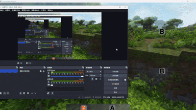

# 如何设计一个类似于Web Toast的控件？

## 前言

​	笔者这段时间沉迷于给我的下位机I.MX6ULL做桌面，这里抽空更新一下QT的东西。这篇文章是跟随CCMoveWidget一样的文章，尝试分享自己如何书写这份代码的思考的过程，和笔者自己反思的不足之处。

​	核心组件是继承自 QWidget 的 DesktopToast 类，其通过 QLabel 作为消息展示载体，并结合 QPropertyAnimation 完成提示动画效果。该设计首先考虑了窗口的非侵入性，使用 Qt 的无边框、Tool 类型窗口标志，并启用透明背景和非激活显示属性，从而实现一个不打断用户操作、不占用任务栏的浮动消息框

## 接口设计

​	相对于上一篇文章的StackWidget_SwitchAnimations而言，这个会好一些，这里笔者设计的接口是这样的：

```c++
#ifndef DESKTOPTOAST_H
#define DESKTOPTOAST_H
#include <QPointer>
#include <QWidget>
#include <QQueue>
class QLabel;
class QPropertyAnimation;
class DesktopToast : public QWidget
{
    Q_OBJECT
public:
    explicit    DesktopToast(QWidget *parent = nullptr);
    /* enqueue the message */
    void        set_message(const QString& message);
signals:
    void        do_show_toast(QString msg);
private:
    void        adjust_place();
    void        start_animation();
    void        start_close_animation();
    /* fetch from pool and display */
    void        set_message_impl(const QString& message);
    QLabel*     label;
    QPoint      startPos, endPos;
    int         animation_maintain_msec{500};
    int         wait_time{1000};
    QPointer<QPropertyAnimation> moveAnimation{nullptr};
    QPointer<QPropertyAnimation> fadeAnimation{nullptr};
    bool isHandling{false};
    /*
     * when large amount of messages smash in,
     * pools do the job of Buffering the message
     * warning: Queue itself is not thread safe, add
     * lock if in multithread
     */
    QQueue<QString> pools;
};

#endif // DESKTOPTOAST_H
```

​	这里区分几个点：第一个事情是label，这个是信息显示的一个载体，startPos, endPos是用来标记控制我们的Toast的位置的。animation_maintain_msec控制动画的时常，wait_time是稳定的事件消息显示。moveAnimation这个是笔者用来控制出现的动画，fadeAnimation是消失的动画。

```c++
#include <QLabel>
#include <QGuiApplication>
#include <QPropertyAnimation>
#include <QScreen>
#include <QTimer>
#include "desktoptoast.h"

// Constructor: configure the window flags and label style
DesktopToast::DesktopToast(QWidget *parent)
    : QWidget{parent}
{
    // Make the window frameless, floating and always on top
    setWindowFlags(Qt::FramelessWindowHint | Qt::Tool | Qt::WindowStaysOnTopHint);
    // Enable translucent background for rounded corners and alpha gradient
    setAttribute(Qt::WA_TranslucentBackground);
    // Do not grab focus or activate the window
    setAttribute(Qt::WA_ShowWithoutActivating);

    // Create the label to display the toast message
    label = new QLabel(this);

    // Use gradient background and rounded corners for better UI appearance
    setStyleSheet(
        "QLabel {"
        "background: qlineargradient(spread:pad, "
        "x1:0, y1:0, x2:1, y2:1, "
        "stop:0 rgba(250, 250, 250, 100), "
        "stop:1 rgba(230, 230, 230, 100));"
        "border-radius: 10px;"
        "}"
    );

    // Connect the internal signal to the implementation slot
    connect(this, &DesktopToast::do_show_toast,
            this, &DesktopToast::set_message_impl);
}

// Play the entry animation to slide the toast into view
void DesktopToast::start_animation()
{
    show(); // ensure the widget is visible
    if (moveAnimation) {
        moveAnimation->stop();       // stop any ongoing animation
        moveAnimation->deleteLater(); // clean up old animation
    }

    // Animate the widget's position from startPos to endPos
    moveAnimation = new QPropertyAnimation(this, "pos");
    moveAnimation->setDuration(animation_maintain_msec);
    moveAnimation->setStartValue(startPos);
    moveAnimation->setEndValue(endPos);
    moveAnimation->setEasingCurve(QEasingCurve::OutCubic); // smooth-out easing
    moveAnimation->start(QAbstractAnimation::DeleteWhenStopped);
}

// Play the exit animation to slide the toast out and prepare for next message
void DesktopToast::start_close_animation()
{
    show(); // required to animate out properly

    if (fadeAnimation) {
        fadeAnimation->stop();
        fadeAnimation->deleteLater();
    }

    // Reuse the position animation for simplicity, sliding back to startPos
    fadeAnimation = new QPropertyAnimation(this, "pos");
    fadeAnimation->setDuration(animation_maintain_msec);
    fadeAnimation->setStartValue(endPos);
    fadeAnimation->setEndValue(startPos);

    // When animation finishes, hide the widget and check the message queue
    connect(fadeAnimation, &QPropertyAnimation::finished, this, [this]() {
        isHandling = false;
        hide();

        // If there are still messages in the queue, show the next one
        if (!pools.isEmpty()) {
            isHandling = true;
            QString msg = pools.dequeue();
            emit do_show_toast(msg);
        }
    });

    fadeAnimation->start(QAbstractAnimation::DeleteWhenStopped);
}

// Calculate and apply the toast position based on parent or screen geometry
void DesktopToast::adjust_place()
{
    QWidget* referenceWidget = parentWidget();
    if (referenceWidget) {
        // Position relative to parent if available
        QRect parentRect = referenceWidget->rect();
        QPoint topCenter(parentRect.width() / 2 - width() / 2, 30);
        endPos = referenceWidget->mapToGlobal(topCenter);
    } else {
        // Otherwise, position at top center of primary screen
#if QT_VERSION >= QT_VERSION_CHECK(5, 10, 0)
        QRect screenGeometry = QGuiApplication::primaryScreen()->availableGeometry();
#else
        QRect screenGeometry = QApplication::desktop()->availableGeometry();
#endif
        int screenWidth = screenGeometry.width();
        int screenX = screenGeometry.x();
        QPoint topCenter(screenX + (screenWidth - width()) / 2, screenGeometry.top() + 30);
        endPos = topCenter;
    }

    // Slide animation will start from above the final position
    startPos = QPoint(endPos.x(), endPos.y() - 70);
    move(startPos);
}

// Enqueue a message to be displayed; if idle, trigger it immediately
void DesktopToast::set_message(const QString& message)
{
    pools.enqueue(message);
    if (!isHandling) {
        isHandling = true;
        QString msg = pools.dequeue();
        emit do_show_toast(msg);
    }
}

// Display the message and start both animations and close timer
void DesktopToast::set_message_impl(const QString& message)
{
    label->setText(message);
    label->adjustSize();
    resize(label->size()); // fit to label size

    adjust_place(); // determine where to show the toast

    show();
    raise(); // bring on top of sibling widgets

    start_animation(); // enter animation

    // Start close animation after wait time + animation duration
    QTimer::singleShot(wait_time + animation_maintain_msec, this, &DesktopToast::start_close_animation);
}

```

​	这里的QString 队列 pools 实现了简单但实用的消息缓冲机制，使该提示框具备顺序展示大量消息的能力，并在注释中清楚地提醒了其非线程安全性。

​	为了避免动画冲突，我是用 QPointer 包装动画对象，在启动前清理旧动画，确保每一次动画都是全新的过程，并用 isHandling 标志位控制消息的串行处理。位置信息由 adjust_place 函数动态调整，无论是否有父窗口，这样总是居中定位在屏幕上方；而实际的展示逻辑通过 set_message_impl 驱动，该函数不仅设置 QLabel 文本并自适应尺寸，还协调动画播放和自动关闭，呈现出一种自然的消息过渡过程。整个机制通过信号 do_show_toast 解耦用户接口与实际执行逻辑，使 set_message 可以无阻塞地写入消息，而真正的展示交给内部状态控制来完成。

​	演示一下：

