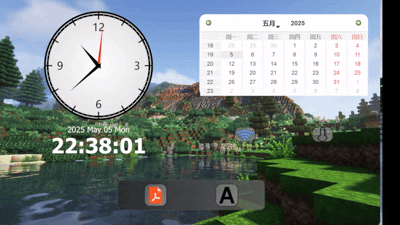

# 如何设计一个QStackWidget的界面切换动画？

## 前言

​	笔者这段时间沉迷于给我的下位机I.MX6ULL做桌面，这里抽空更新一下QT的东西。这篇文章是跟随CCMoveWidget一样的文章，尝试分享自己如何书写这份代码的思考的过程，和笔者自己反思的不足之处。

## 接口考虑

​	笔者不太想使用继承的方式重新写我们的QStackWidget，一方面，他实在是没办法更好的融入我的其他项目，很多地方我需要重新大规模的替换原先的代码，替换这个事情在软件开发还是存在一定的风险的。因此笔者选择做加法——让QStackWidget可以做动画（不需要的时候直接不使用接口函数即可）

​	总的来讲，笔者做出了这些抽象

```c++
#ifndef STACKPAGE_SWITCHER_ANIMATION_H
#define STACKPAGE_SWITCHER_ANIMATION_H
#include <QObject>
class QStackedWidget;

struct StackpageSwitcherAnimation : public QObject
{
    Q_OBJECT
public:
    explicit StackpageSwitcherAnimation(QObject* parent = nullptr) : QObject(parent){}

    struct AnimationInfo{
        int     new_index;
        bool    toLeft;
        int     animation_duration{400};
    };

    static void process_animations(
        QStackedWidget* binding_widget,
        AnimationInfo* animation_info);
};

#endif // STACKPAGE_SWITCHER_ANIMATION_H
```

​	可以看到还是很简单的一份接口，下面我来说一说实现

## 实现的思路

​	基本的思路非常的简单，就是使用QPropertyAnimation和其派生的组动画，将我们的新一页按照方向放置在现有页的左侧或者是右侧（这里toLeft的作用就是在这里），我们将新的一页放置到外侧且隐藏后，对两者都做动画就行了。

```c++
#include "stackpage_switcher_animation.h"
#include <QPropertyAnimation>
#include <QStackedWidget>
#include <QParallelAnimationGroup>

void StackpageSwitcherAnimation::process_animations(
    QStackedWidget* binding_widget, AnimationInfo* animation_info)
{
    QWidget *currentPage = binding_widget->currentWidget();
    QWidget *nextPage = binding_widget->widget(animation_info->new_index);

    int moving_width = animation_info->toLeft ? binding_widget->width() : -binding_widget->width();
    nextPage->move(moving_width, 0);
    nextPage->show();

    /* moves out */
    QPropertyAnimation *animCurrent = new QPropertyAnimation(currentPage, "pos");
    animCurrent->setDuration(300);
    animCurrent->setStartValue(currentPage->pos());
    animCurrent->setEndValue(QPoint(-moving_width, 0));

    /* moves in */
    QPropertyAnimation *animNext = new QPropertyAnimation(nextPage, "pos");
    animNext->setDuration(300);
    animNext->setStartValue(nextPage->pos());
    animNext->setEndValue(QPoint(0, 0));

    QParallelAnimationGroup *group = new QParallelAnimationGroup(binding_widget);
    group->addAnimation(animCurrent);
    group->addAnimation(animNext);

    connect(group, &QParallelAnimationGroup::finished, binding_widget, [=]() {
        binding_widget->setCurrentWidget(nextPage);
        currentPage->move(0, 0); // 复位旧页面
    });

    group->start(QAbstractAnimation::DeleteWhenStopped);
}
```

​	QParallelAnimationGroup在这里还是很简单的意思，那就是保证动画的同步开始和同步的结束。

​	这份代码是笔者目前用在项目中的，您可以自行更改学习研究！以上！

